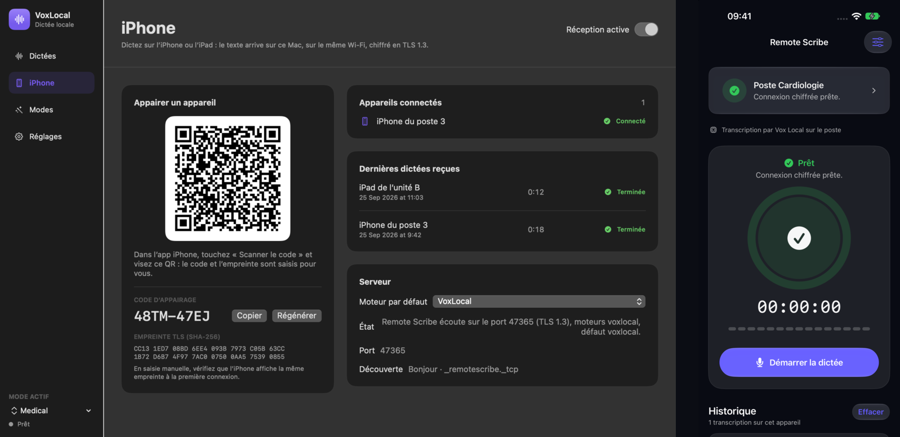
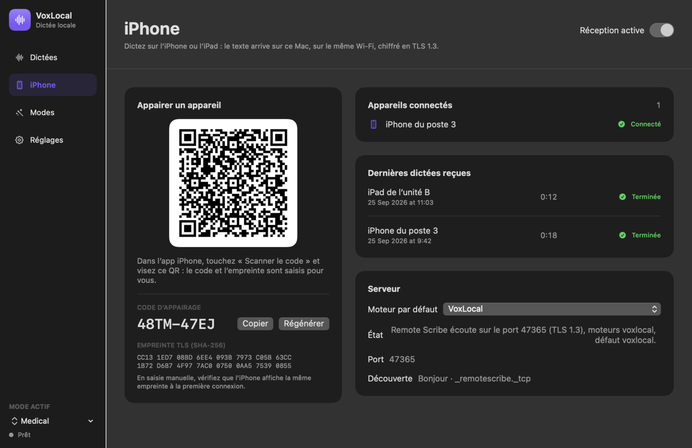
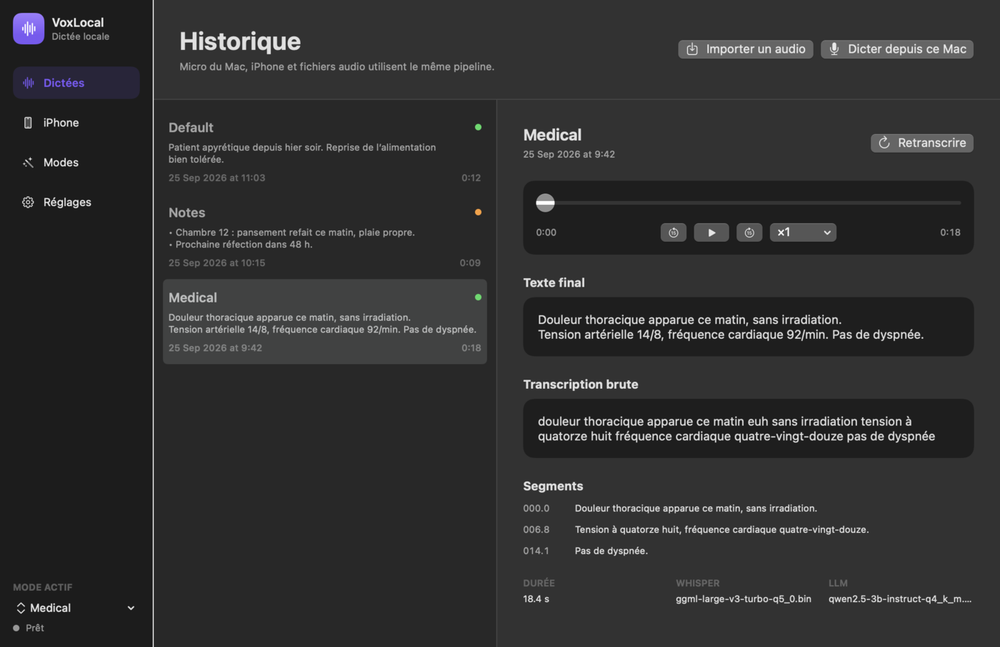
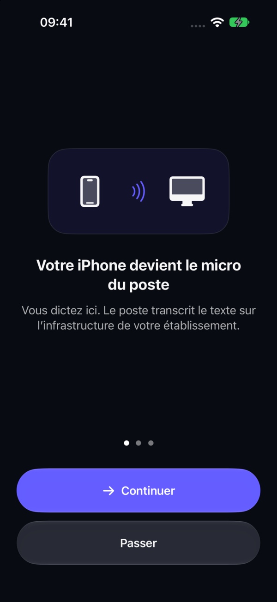
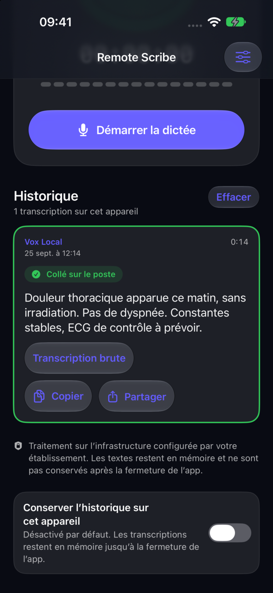

# VoxLocal — one page

**Clinical dictation that never leaves the hospital.** The clinician speaks into an iPhone; a Mac or Windows workstation on the ward transcribes and cleans up the text with open models, then pastes it into the record that is already open.

## Problem

Clinicians spend a large part of their day typing notes. Dictation tools exist, but the good ones are cloud services: the patient's voice and the note travel to a vendor's servers, often outside the EU. For a European hospital, that means a data-protection review for every tool, and often a "no". So clinicians keep typing.

## Insight

A recent Mac with Apple silicon runs Whisper and a small instruction-tuned LLM fast enough to dictate in real time. On the development machine (M2, 16 GB), with the smallest models, transcribing 19.8 s of French dictation takes 0.66 s and the "Medical" rewrite 1.2 s once the model is warm ([measurement](mac-performance.md); production-size models are not measured yet). Dictation no longer needs a cloud. The hard part is everything around the model: a phone as microphone, pairing, transport security, pasting into the right window, and a security story an IT department signs off on.

## Product today

- **VoxLocal for macOS** (2.3.0): local whisper.cpp + llama.cpp, a warm LLM server, writing "modes" (Medical, Notes, Email…), a dictation history with re-transcription, and a Remote Scribe screen that pairs iPhones with a QR code.
- **Remote Scribe for iPhone and iPad** (1.3): three-screen onboarding, QR pairing, TLS 1.3 with certificate pinning, the result pasted on the workstation and shown on the phone.
- **Windows and headless hosts**: a Python reference host (no third-party dependencies) with an installer that CI runs for real on Windows.
- **Optional private GPU**: a RunPod image behind a single authenticated HTTPS gateway, for larger models. Designed and exercised locally; no GPU pod has been provisioned yet.
- **Agent API**: a loopback HTTP/CLI contract so local AI agents can transcribe and clean text without seeing any secret.

| Mac: pairing an iPhone | Mac: dictation history | iPhone: first run | iPhone: result pasted on the workstation |
|---|---|---|---|
|  |  |  |  |

Security is documented section by section in the [security whitepaper](security-whitepaper.md) (French). CI runs on Linux, Windows and macOS.

## Why now

- Open speech models (Whisper) and open instruction-tuned LLMs (Qwen) are small enough to run on a workstation at dictation speed. Their accuracy on French clinical dictation still has to be measured in a pilot.
- Apple silicon puts a capable GPU on every recent Mac in a hospital.
- European hospitals face stricter scrutiny of where health data is processed, which favours on-premise tools over US cloud APIs.

## Business model

A per-seat annual licence sold to the hospital, deployed on its own workstations. An optional managed private GPU for services that want larger models, billed separately. Prices are not set yet; they will come out of the first pilots.

## Where we are, and what we ask

- **Stage:** working prototype. Every result above comes from synthetic data. No hospital has used it; no pilot is signed yet.
- **Before a clinical pilot:** Apple signing and notarisation, device enrolment through the hospital's MDM (mTLS), a GPU provider contract with zero data retention if the GPU option is used, validation by the hospital's DPO, and clinical validation of the rewritten notes. The list and its status: [release readiness](release-readiness.md), [roadmap](roadmap.md).
- **Ask:** introductions to hospital services willing to run a pilot on synthetic, then real, dictations; and funding to reach a signed, notarised product and a first clinical pilot.

## Team

*[Nassim to fill: names, roles, relevant background.]*
